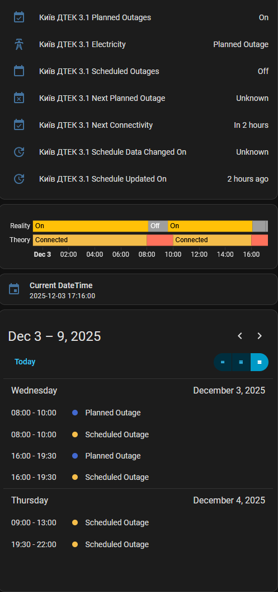

[](https://stand-with-ukraine.pp.ua)
[](https://stand-with-ukraine.pp.ua)
[](https://stand-with-ukraine.pp.ua)
[](https://stand-with-ukraine.pp.ua)

[![GitHub Release][gh-release-image]][gh-release-url]
[![hacs][hacs-image]][hacs-url]


# 💡 Svitlo Yeah | Світло Є

A [Home Assistant][home-assistant] integration that tracks electricity outage schedules from Ukrainian energy providers, providing outage calendars, countdown timers, and status updates.

###### [Цей документ українською](https://github-com.translate.goog/ALERTua/ha-svitlo-yeah/blob/main/README.md?_x_tr_sl=en&_x_tr_tl=uk&_x_tr_hl=en&_x_tr_pto=wapp)

## Supported Regions

| Region                         | Provider | Data Source                                                                                                             |
|--------------------------------|----------|-------------------------------------------------------------------------------------------------------------------------|
| **Kyiv**                       | DTEK     | [Yasno API](https://yasno.ua)                                                                                           |
| **Dnipro**                     | DnEM     | [Yasno API](https://yasno.ua)                                                                                           |
| **Dnipro**                     | CEK      | [Yasno API](https://yasno.ua)                                                                                           |
| **Kyiv Oblast**                | DTEK     | [Baskerville42/outage-data-ua](https://github.com/Baskerville42/outage-data-ua/blob/main/data/kyiv-region.json)         |
| **Dnipro and Oblast**          | DTEK     | [Baskerville42/outage-data-ua](https://github.com/Baskerville42/outage-data-ua/blob/main/data/dnipro.json)              |
| **Odesa and Oblast**           | DTEK     | [Baskerville42/outage-data-ua](https://github.com/Baskerville42/outage-data-ua/blob/main/data/odesa.json)               |
| **Khmelnytskyi**               | HOE      | [yaroslav2901/OE_OUTAGE_DATA](https://github.com/yaroslav2901/OE_OUTAGE_DATA/blob/main/data/Khmelnytskoblenerho.json)  |
| **Ivano-Frankivsk and Oblast** | POE      | [yaroslav2901/OE_OUTAGE_DATA](https://github.com/yaroslav2901/OE_OUTAGE_DATA/blob/main/data/Prykarpattiaoblenerho.json) |
| **Uzhhorod and Oblast**        | ZOE      | [yaroslav2901/OE_OUTAGE_DATA](https://github.com/yaroslav2901/OE_OUTAGE_DATA/blob/main/data/Zakarpattiaoblenerho.json)  |
| **Lviv and Oblast**            | LOE      | [yaroslav2901/OE_OUTAGE_DATA](https://github.com/yaroslav2901/OE_OUTAGE_DATA/blob/main/data/Lvivoblenerho.json)         |


## Installation

The quickest way to install this integration is via [HACS][hacs-url] by clicking the button below:

[![Add to HACS via My Home Assistant][hacs-install-image]][hasc-install-url]

If it doesn't work, adding this repository to HACS manually by adding this URL:

1. Visit **HACS** → **Integrations** → **...** (in the top right) → **Custom repositories**
2. Click **Add**
3. Paste `https://github.com/ALERTua/ha-svitlo-yeah` into the **URL** field
4. Chose **Integration** as a **Category**
5. **Svitlo Yeah | Світло Є** will appear in the list of available integrations. Install it normally.

## Usage

This integration is configurable via UI. On **Devices and Services** page, click **Add Integration** and search for **Svitlo Yeah**.

### Select your region and Service Provider (if applicable)


### Select your Group


### Here's how the devices look


### Sensors

 

### Calendar View
Then you can add the integration to your dashboard and see the information about the next planned outages.
Integration also provides a calendar view of planned outages. You can add it to your dashboard as well via [Calendar card][calendar-card].


### Examples

- [Automation](/examples/automation.yaml)
- [Dashboard](/examples/dashboard.yaml)



## Integration Entities

The integration creates the following entities in Home Assistant:

### Sensors

| Entity                       | Type             | Purpose                                                          | Description                                                                                                                                                                                                                                                                                                                                              |
|------------------------------|------------------|------------------------------------------------------------------|----------------------------------------------------------------------------------------------------------------------------------------------------------------------------------------------------------------------------------------------------------------------------------------------------------------------------------------------------------|
| **Electricity**              | Enum Sensor      | Shows current power connectivity state according to the calendar | Indicates the current electricity status with three possible states: `connected` (normal power), `planned_outage` (scheduled blackout), or `emergency` (unscheduled blackout). Reflects the calendar state and shows if there is an ongoing outage event at the moment. Provides additional attributes including event details when an outage is active. |
| **Schedule Updated On**      | Timestamp Sensor | Shows when outage schedule was last updated by the provider      | Displays the timestamp when the energy provider last updated the outage schedule on their servers. Reflects server-side data changes, not client fetch times.                                                                                                                                                                                            |
| **Schedule Data Changed On** | Timestamp Sensor | Shows when actual outage schedule data changed                   | Tracks the timestamp when the actual data was modified. Useful for notifications when schedules are updated. See examples.                                                                                                                                                                                                                               |
| **Next Planned Outage**      | Timestamp Sensor | Shows the start time of the next scheduled blackout              | Displays the timestamp when the next planned power outage is scheduled to begin. Null when no outages are scheduled.                                                                                                                                                                                                                                     |
| **Next Connectivity**        | Timestamp Sensor | Shows when power is expected to return                           | Displays the timestamp when power connectivity is expected to be restored after an outage. Null when no outages are active.                                                                                                                                                                                                                              |

### Calendar

| Entity                       | Type            | Purpose                                            | Description                                                                                                                                                                                                                                                    |
|------------------------------|-----------------|----------------------------------------------------|----------------------------------------------------------------------------------------------------------------------------------------------------------------------------------------------------------------------------------------------------------------|
| **Planned Outages Calendar** | Calendar Entity | Provides calendar integration for outage schedules | Shows all planned power outages as calendar events. Can be used with Home Assistant's calendar cards, automations, and triggers. Events include "Definite" planned outages and "Emergency" unscheduled blackouts. The calendar state is `on` during any event. |

### Events

| Event                        | Description                             |
|------------------------------|-----------------------------------------|
| **svitlo_yeah_data_changed** | Fired when outage data actually changes |

### Entity Usage Examples

- Use the **Electricity** sensor in dashboards to display current power status from the calendar perspective
- Set up notifications when **Schedule Data Changed On** updates to alert about schedule changes
- Or use the event to trigger on:
```yaml
event_type: svitlo_yeah_data_changed
data:
  region: Київ
  provider: ПРАТ «ДТЕК КИЇВСЬКІ ЕЛЕКТРОМЕРЕЖІ»
  group: "3.1"
  last_data_change: "2025-11-15T14:20:24.627353+02:00"
  config_entry_id: 01K9Q7AZX5KF5F6352RX98JY9T
time_fired: "2025-11-15T12:20:24.627416+00:00"
```
- Use the **Planned Outages Calendar** with calendar triggers for advance warnings before outages
- Monitor **Next Planned Outage** and **Next Connectivity** timestamps for countdown displays

## Contributing

See [CONTRIBUTING.md](CONTRIBUTING.md) for information about adding new regions and contributing to the project.

<!-- Badges -->

[gh-release-url]: https://github.com/ALERTua/ha-svitlo-yeah/releases/latest
[gh-release-image]: https://img.shields.io/github/v/release/ALERTua/ha-svitlo-yeah?style=flat-square
[gh-downloads-url]: https://github.com/ALERTua/ha-svitlo-yeah/releases
[hacs-url]: https://github.com/hacs/integration
[hacs-image]: https://img.shields.io/badge/hacs-default-orange.svg?style=flat-square

<!-- References -->

[home-assistant]: https://www.home-assistant.io/
[hasc-install-url]: https://my.home-assistant.io/redirect/hacs_repository/?owner=ALERTua&repository=ha-svitlo-yeah&category=integration
[hacs-install-image]: https://my.home-assistant.io/badges/hacs_repository.svg
[calendar-card]: https://www.home-assistant.io/dashboards/calendar/
