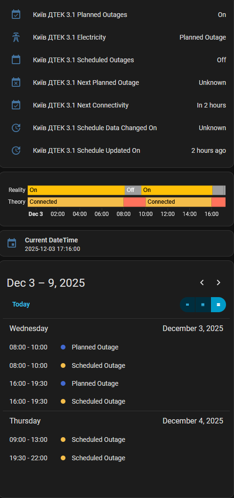

[](https://stand-with-ukraine.pp.ua)
[](https://stand-with-ukraine.pp.ua)
[](https://stand-with-ukraine.pp.ua)
[](https://stand-with-ukraine.pp.ua)

[![GitHub Release][gh-release-image]][gh-release-url]
[![hacs][hacs-image]][hacs-url]


# 💡 Svitlo Yeah | Світло Є

A [Home Assistant][home-assistant] integration that tracks electricity outage schedules from Ukrainian energy providers,
providing outage calendars, countdown timers, and status updates.

###### [Цей документ українською](https://github-com.translate.goog/ALERTua/ha-svitlo-yeah/blob/main/README.md?_x_tr_sl=en&_x_tr_tl=uk&_x_tr_hl=en&_x_tr_pto=wapp)

## Supported Regions

| Region                         | Provider | Data Source                                                                                                                                                                                                                             |
|--------------------------------|----------|-----------------------------------------------------------------------------------------------------------------------------------------------------------------------------------------------------------------------------------------|
| **Kyiv**                       | DTEK     | [Yasno API](https://yasno.ua)                                                                                                                                                                                                           |
| **Dnipro**                     | DnEM     | [Yasno API](https://yasno.ua)                                                                                                                                                                                                           |
| **Dnipro**                     | CEK      | [Yasno API](https://yasno.ua)                                                                                                                                                                                                           |
| **Kyiv Oblast**                | DTEK     | [Baskerville42/outage-data-ua](https://github.com/Baskerville42/outage-data-ua/blob/main/data/kyiv-region.json)                                                                                                                         |
| **Dnipro and Oblast**          | DTEK     | [Baskerville42/outage-data-ua](https://github.com/Baskerville42/outage-data-ua/blob/main/data/dnipro.json)                                                                                                                              |
| **Odesa and Oblast**           | DTEK     | [Baskerville42/outage-data-ua](https://github.com/Baskerville42/outage-data-ua/blob/main/data/odesa.json)                                                                                                                               |
| **Khmelnytskyi and Oblast**    | KhOE     | [yaroslav2901/OE_OUTAGE_DATA](https://github.com/yaroslav2901/OE_OUTAGE_DATA/blob/main/data/Khmelnytskoblenerho.json)                                                                                                                   |
| **Ivano-Frankivsk and Oblast** | POE      | [yaroslav2901/OE_OUTAGE_DATA](https://github.com/yaroslav2901/OE_OUTAGE_DATA/blob/main/data/Prykarpattiaoblenerho.json)                                                                                                                 |
| **Uzhhorod and Oblast**        | ZOE      | [yaroslav2901/OE_OUTAGE_DATA](https://github.com/yaroslav2901/OE_OUTAGE_DATA/blob/main/data/Zakarpattiaoblenerho.json)                                                                                                                  |
| **Lviv and Oblast**            | LOE      | [yaroslav2901/OE_OUTAGE_DATA](https://github.com/yaroslav2901/OE_OUTAGE_DATA/blob/main/data/Lvivoblenerho.json)                                                                                                                         |
| **Ternopil and Oblast**        | TOE      | [yaroslav2901/OE_OUTAGE_DATA](https://github.com/yaroslav2901/OE_OUTAGE_DATA/blob/main/data/Ternopiloblenerho.json)                                                                                                                     |
| **Chernihiv and Oblast**       | ChOE     | [yaroslav2901/OE_OUTAGE_DATA](https://github.com/yaroslav2901/OE_OUTAGE_DATA/blob/main/data/Chernihivoblenergo.json)                                                                                                                    |
| **Zaporizhzhia and Oblast**    | ZOE      | [yaroslav2901/OE_OUTAGE_DATA](https://github.com/yaroslav2901/OE_OUTAGE_DATA/blob/main/data/Zaporizhzhiaoblenergo.json)                                                                                                                 |
| **Zhytomyr and Oblast**        | ZOE      | [yaroslav2901/OE_OUTAGE_DATA](https://github.com/yaroslav2901/OE_OUTAGE_DATA/blob/main/data/Zhytomyroblenergo.json)                                                                                                                     |
| **Poltava and Oblast**         | POE      | [yaroslav2901/OE_OUTAGE_DATA](https://github.com/yaroslav2901/OE_OUTAGE_DATA/blob/main/data/Poltavaoblenergo.json)                                                                                                                      |
| **Rivne and Oblast**           | ROE      | [yaroslav2901/OE_OUTAGE_DATA](https://github.com/yaroslav2901/OE_OUTAGE_DATA/blob/main/data/Rivneoblenergo.json)                                                                                                                        |
| **Vinnytsia and Oblast**       | VOE      | [olnet93/gpv-voe-vinnytsia](https://github.com/olnet93/gpv-voe-vinnytsia/blob/main/data/Vinnytsiaoblenerho.json)<br/>[vn-progr/gpv-voe-vinnytsia](https://github.com/vn-progr/gpv-voe-vinnytsia/blob/main/data/Vinnytsiaoblenerho.json) |
| **Sumy and Oblast**            | SOE      | [E-Svitlo API](https://sm.e-svitlo.com.ua/)                                                                                                                                                                                             |

## Installation

The quickest way to install this integration is via [HACS][hacs-url] by clicking the button below:

[![Add to HACS via My Home Assistant][hacs-install-image]][hasc-install-url]

If it doesn't work, adding this repository to HACS manually by adding this URL:

1. Visit **HACS** → **Integrations** → **...** (in the top right) → **Custom repositories**
2. Click **Add**
3. Paste `https://github.com/ALERTua/ha-svitlo-yeah` into the **URL** field
4. Choose **Integration** as a **Category**
5. **Svitlo Yeah | Світло Є** will appear in the list of available integrations. Install it normally.

## Usage

This integration is configurable via UI. On **Devices and Services** page, click **Add Integration** and search for **Svitlo Yeah**.

### Setup parameters

Before you start, find your outage group on the website of your provider. For Sumy and Oblast, you need the login and the password of your E-Svitlo personal cabinet instead, because E-Svitlo gives the group of your personal account.

| Step | Field | Description |
|---|---|---|
| Select Region/System Distribution | Select your region/system distribution | The region or the distribution system operator that supplies electricity to your address. The list has each region of [Supported Regions](#supported-regions). |
| Outdated schedule data | I understand and accept the risk | Shows only when no DTEK JSON source of the region has fresh data. Select it to pick your group from the outdated schedule. See [Outdated schedule data](#outdated-schedule-data-dtek-json). |
| Settings | Select your group | Your outage group, for example `1.1`. Find it on the website of your provider, for example [Yasno](https://static.yasno.ua/kyiv/outages) or [DTEK](https://www.dtek-krem.com.ua/ua/shutdowns). For DTEK Dnipro, the list shows a CEK group with its number in the source, for example «ЦЕК 1.1 (1001.1)». |
| E-Svitlo Authentication | Username | The login of your [E-Svitlo personal cabinet](https://sm.e-svitlo.com.ua/). |
| E-Svitlo Authentication | Password | The password of your E-Svitlo personal cabinet. |
| Select Account | Account | The personal account (address) whose outage schedule the entry shows. For another address, add one more entry. |

Each region and group is a separate entry. To change the group of a DTEK or Yasno entry later, open the menu of the entry and select **Reconfigure**. It shows the **Select your group** field again. Reconfigure does not change an E-Svitlo entry, because E-Svitlo gives the group of the personal account. For another personal account, delete the entry and add it again.

### Select your region and Service Provider (if applicable)


### Select your Group


### Outdated schedule data (DTEK JSON)

When there are no outages for a while, DTEK JSON sources may stop publishing and all data becomes outdated. In that case setup shows a confirmation step: you can still pick your group from the last-known schedule after acknowledging the risk. Once outages resume, double-check that your group hasn't changed.

The outdated data serves only the choice of the group, and the integration does not use it after setup. The integration keeps the last fresh schedule of each entry, also across a restart of Home Assistant. If a source becomes outdated or does not answer, the integration uses that schedule until the source publishes fresh data again, also when that schedule gets older. The **Schedule Updated On** sensor shows the update time of the schedule that the integration uses.

### E-Svitlo refuses the login

If E-Svitlo refuses the login of an entry, for example after you change the password, Home Assistant shows a notification on the **Devices & services** page. Open it, and enter the current login and password. The new login must have access to the personal account of the entry. Until then, the entities show the last schedule, and the integration tries the old login at each update. If E-Svitlo refuses the login only for a while, for example during maintenance, the next update that logs in brings the schedule back by itself, and the notification disappears.

### Here's how the devices look


### Sensors

 

### Calendar View

Then you can add the integration to your dashboard and see the information about the next planned outages.
Integration also provides a calendar view of planned outages. You can add it to your dashboard as well
via [Calendar card][calendar-card].


### Examples

- [Automation](/examples/automation.yaml)
- [Dashboard](/examples/dashboard.yaml)



## Integration Entities

The integration creates the following entities in Home Assistant:

### Sensors

| Entity                                                                                   | Type             | Purpose                                                          | Description                                                                                                                                                                                                                                                                                                                                              |
|------------------------------------------------------------------------------------------|------------------|------------------------------------------------------------------|----------------------------------------------------------------------------------------------------------------------------------------------------------------------------------------------------------------------------------------------------------------------------------------------------------------------------------------------------------|
| **Electricity**                                                                          | Enum Sensor      | Shows current power connectivity state according to the calendar | Indicates the current electricity status with three possible states: `connected` (normal power), `planned_outage` (scheduled blackout), or `emergency` (unscheduled blackout). Shows `unknown` while the source has no schedule for the configured group. Shows `connected` while the integration has no DTEK schedule, for example for a new entry while the source has no fresh data, because the integration has no outage events then. Reflects the calendar state and shows if there is an ongoing outage event at the moment. Provides additional attributes including event details when an outage is active. |
| [**Schedule Updated On**](/custom_components/svitlo_yeah/translations/uk.json#L97)       | Timestamp Sensor | Shows when outage schedule was last updated by the provider      | Displays the timestamp when the energy provider last updated the outage schedule on their servers. Reflects server-side data changes, not client fetch times.                                                                                                                                                                                            |
| [**Schedule Data Changed On**](/custom_components/svitlo_yeah/translations/uk.json#L100) | Timestamp Sensor | Shows when actual outage schedule data changed                   | Tracks the timestamp when the actual data was modified. Useful for notifications when schedules are updated. See examples.                                                                                                                                                                                                                               |
| [**Next Planned Outage**](/custom_components/svitlo_yeah/translations/uk.json#L104)      | Timestamp Sensor | Shows the start time of the next planned outage                  | Displays the timestamp when the upcoming planned outage is planned to begin. Null when there are no planned outages.                                                                                                                                                                                                                                     |
| [**Next Scheduled Outage**](/custom_components/svitlo_yeah/translations/uk.json#L107)    | Timestamp Sensor | Shows the start time of the next scheduled outage                | Displays the timestamp of the upcoming scheduled outage event, comparing scheduled outages and planned outages to show whichever comes first. Null when no outages are scheduled or planned.                                                                                                                                                             |
| [**Next Connectivity**](/custom_components/svitlo_yeah/translations/uk.json#L109)        | Timestamp Sensor | Shows when power is expected to return                           | Displays the timestamp when power connectivity is expected to be restored after an outage. Null when no outages are active.                                                                                                                                                                                                                              |

**Scheduled vs Planned Outages:**
- **Scheduled Outage**: Time windows when outages MAY happen (potential outage periods that are scheduled for your Outage Group)
- **Planned Outage**: Confirmed outages that WILL happen (actual outage periods for your Outage Group)

### Calendar

| Entity                         | Type            | Purpose                                           | Description                                                                                                                                                                                                                                                    |
|--------------------------------|-----------------|---------------------------------------------------|----------------------------------------------------------------------------------------------------------------------------------------------------------------------------------------------------------------------------------------------------------------|
| **Planned Outages Calendar**   | Calendar Entity | Provides calendar integration for planned outages | Shows all planned power outages as calendar events. Can be used with Home Assistant's calendar cards, automations, and triggers. Events include "Definite" planned outages and "Emergency" unscheduled blackouts. The calendar state is `on` during any event. |
| **Scheduled Outages Calendar** | Calendar Entity | Provides calendar integration for outage schedule | Shows the power outages schedule.                                                                                                                                                                                                                              |

### Button

| Entity                | Type          | Purpose                                            | Description                                                                                                                                                                                 |
|-----------------------|---------------|----------------------------------------------------|---------------------------------------------------------------------------------------------------------------------------------------------------------------------------------------------|
| **Force refresh now** | Button Entity | Forces an immediate refresh of the outage schedule | Triggers a data refresh right away, ignoring the regular update interval. Useful to pull a freshly published schedule without waiting. Data still refreshes automatically on its own timer. If the source does not answer, the press fails with an error, and the entities keep the last schedule. An outdated DTEK schedule is not an error. If an automation presses the button, add `continue_on_error: true` to that step, so that the automation does not stop on the error. |

### Events

| Event                        | Description                             |
|------------------------------|-----------------------------------------|
| **svitlo_yeah_data_changed** | Fired when outage data actually changes |

```yaml
event_type: svitlo_yeah_data_changed
data:
  region_name: Київ  # yes, Cyrillic. This is how it comes from the API
  region_id: 25
  provider_id: 902
  provider_name: ПРАТ «ДТЕК КИЇВСЬКІ ЕЛЕКТРОМЕРЕЖІ»
  group: "3.1"
  last_data_change: "2025-11-15T14:20:24.627353+02:00"
  config_entry_id: 01KB817HS8R32RSYH5RW01G78Z
```

```yaml
event_type: svitlo_yeah_data_changed
data:
  region_name: odesa
  region_id: null
  provider_id: null
  provider_name: null
  group: "1.1"
  last_data_change: "2025-11-15T14:20:24.627353+02:00"
  config_entry_id: 01KB817S4AXVFB39X97NGYCV55
```

### Entity Usage Examples

- Use the **Electricity** sensor in dashboards to display current power status from the calendar perspective
- Set up notifications when **Schedule Data Changed On** updates to alert about schedule changes
- Or use the event to trigger on (described above and in [automation examples](/examples/automation.yaml))
- Use the **Planned Outages Calendar** with calendar triggers for advance warnings before outages
- Monitor **Next Planned Outage** and **Next Connectivity** timestamps for countdown displays

### Caveats

- To get your Yasno group, you can use this [](/media/yasno_group.gif)
- This project is intended to be used as a Home Assistant / HACS integration, not as a standalone Python library — the API classes require a Home Assistant instance. If you'd like the code to be usable outside the HACS integration as a plain Python library, let me know and I'll consider adding support for that.

## Removing the integration

This integration follows standard integration removal. Each entry keeps its last schedule in the storage of Home Assistant. When you delete an entry, Home Assistant removes its device and its entities, and the integration removes its repair issue and its stored schedule.

Each provider and group is a separate entry, and so is each E-Svitlo account. To remove an entry:

1. Go to **Settings** → **Devices & services**, and select the **Svitlo Yeah!** card.
2. Next to the entry that you want to remove, select the three dots **⋮** menu.
3. Select **Delete**.

To remove the integration files too, delete all entries first. Then open **HACS**, find **Svitlo Yeah | Світло Є**, select the three dots **⋮** menu, and select **Remove**. Restart Home Assistant.

Automations, scripts and dashboards that use the entities or the `svitlo_yeah_data_changed` event stay. Change or delete them yourself.

## Contributing

See [CONTRIBUTING.md](CONTRIBUTING.md) for information about adding new regions and contributing to the project.

<!-- Badges -->

[gh-release-url]: https://github.com/ALERTua/ha-svitlo-yeah/releases/latest

[gh-release-image]: https://img.shields.io/github/v/release/ALERTua/ha-svitlo-yeah?style=flat-square

[gh-downloads-url]: https://github.com/ALERTua/ha-svitlo-yeah/releases

[hacs-url]: https://github.com/hacs/integration

[hacs-image]: https://img.shields.io/badge/hacs-default-orange.svg?style=flat-square

<!-- References -->

[home-assistant]: https://www.home-assistant.io/

[hasc-install-url]: https://my.home-assistant.io/redirect/hacs_repository/?owner=ALERTua&repository=ha-svitlo-yeah&category=integration

[hacs-install-image]: https://my.home-assistant.io/badges/hacs_repository.svg

[calendar-card]: https://www.home-assistant.io/dashboards/calendar/
